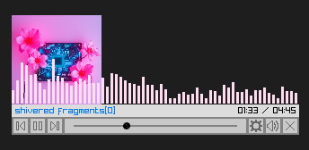

# minitune

Mini music player with customizable playlist support.

 [video](https://www.youtube.com/watch?v=yznHvXmp9Bc)  
<sup>The track shown above is [Shivered Fragments](https://suno.com/song/1f77498f-1861-4f3b-90b4-d35b29c30745) by kick ice on Suno. It's a very good song, please listen to it!</sup>

Made using [Raylib v5.5](https://github.com/raysan5/raylib) with Raygui v4.0.
- Raylib: uses commit **11429b4** for `SeekMusicStream()` fix (issue #4521), built from source.

Uses [libwinsane](https://github.com/skeeto/scratch/tree/master/libwinsane) to support unicode filepaths on Windows.

## How to Build
- **Windows**: Download this repository and use the command `make release` to build the executable.
- **Linux**: Link with the Linux build for Raylib, then run gcc with flags `-lraylib -lGL -lm -lpthread -ldl -lrt -lX11`


## Usage
- Drag and drop:
    - Audio files
    - .txt files containing absolute paths to audio files, separated by newlines.
        - After each song path, you can optionally include `-title:` and `-art:` lines to customize the displayed title and artwork.
        ```
        C:\...\song.mp3
        - title:My Song
        - art:C:\...\albumart.png
        C:\...\song2.mp3
        - title:My Song2
        - art:C:\...\albumart2.png
        ``` 
- Left/Right: Jump forward/backward 3 seconds
- Up/Down: Raise/lower volume
- Space: Toggle pause
- S: Toggle shuffle
- I: Toggle image display

## Command Line Args

Optionally, minitune can be started from the command line with additional arguments. The following arguments can be given in any order:
- `-top`: enable Always On Top.
- `-full`: If a playlist .txt file contains images, the image will display at a larger size, spanning the full window width.
- `<filepath>`: The first argument not beginning with `-` will be treated as a filepath to an audio file or playlist. This file will be automatically loaded at startup.

## How it Works
- Load music file into a Music stream instance.
- Use Raylib's `AttachAudioStreamProcessor()` to read samples from audio buffer.
- Samples are 32-bit floats in range (-1, 1)

### Volume Visualization
- Take root mean square (RMS) of samples.
```math
\text{RMS} = \sqrt{\frac{1}{N} \sum_{i=1}^N {x_i}^2}
```
- Convert to decibels, set minimum to -40 dB.
```math
\text{dB} = 20 * log_{10}(\text{RMS})
```

### Frequency Visualization
- Fast Fourier Transform on samples.
- FFT code from: https://rosettacode.org/wiki/Fast_Fourier_transform#C
- FFT magnitude:
```math
|k| = \sqrt{\text{real(k)}^2 + \text{imag(k)}^2}
```
- Magnitude is then converted into decibels.
- **Limitations**:
    - Raylib has a fixed frame buffer size of 480 samples, which is padded to 512 samples for FFT.
    - At a 48000 Hz sampling rate, the frequency bin resolution is $\Delta f = 48000/512 \approx 93.75\ \text{Hz}$, which ends up grouping many of the lower frequencies into a single bin.

## Future Work
- UI for volume adjustment
- Settings UI for toggling shuffle and configuring visualizations
- More visualizations
- Manually buffering more samples for more granular FFT results
